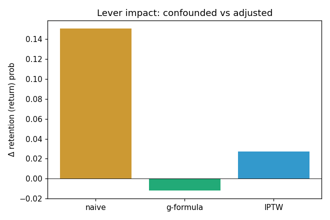
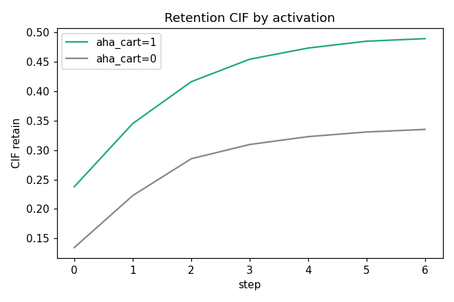

# 활성화→리텐션 생존분석 + g-계산 임팩트 — 그로스 데이터 분석

**리텐션을 인과적으로 정직하게 다루고(검열·누수·교란을 *방법으로* 처리), "어떤 초기 행동을 올리면 회사가 얼마나
나아가는가"를 g-계산으로 정량화하는 그로스 분석 프로젝트.** 상세 설계는 [`PLAN.md`](PLAN.md).

## 분석 질문
신규(관측) 유저를 **무슨 초기 행동으로 활성화**시켜야 전환·리텐션이 오르나? 그 활성화 지표를 올리면 비즈니스
임팩트는 얼마인가 — 그리고 그 추정이 *무엇을 주장할 수 있고 없는지*?

## 데이터
[MerRec](https://huggingface.co/datasets/mercari-us/merrec) — Mercari 공식 C2C 행동 이벤트 로그(KDD 2025).
`item_view → item_like → add_to_cart → offer → buy_comp` 풀퍼널 + 유저·세션·시계열. **가입 필드 없음**(→ t0=첫 관측,
좌측절단을 생존모델 지연진입으로 처리). 5개 파티션(20230501, 277만 이벤트·43k 유저)으로 실행. 합성 fixture는 오프라인
ground-truth 테스트 백스톱.

> **Phase-0 핵심 발견 → 결과 재정의**: MerRec 첫 구매는 *즉시적*(t0로부터 중앙값 0일, 전환 80%가 피처 창 안). 즉 첫 구매는
> *획득*이지 리텐션이 아니며, 누수 안전 결과 창엔 전환이 거의 안 남는다. 그래서 스파인은 **엠바고 이후 재방문(=리텐션)**을
> 모델링한다(D-1에 보조로 사전등록된 결과를 주력 승격 — 사후 낚시 아님). 상세: `docs/log.md`, `docs/decisions.md` A-1.

## 접근 (요약 — 상세는 PLAN.md)
1. **Phase 0 게이트** — 유저 타임라인·이벤트(전환=`buy_comp`)·검열(우검열·좌측절단) 정의가 서는지 EDA로 검증.
2. **스파인 = 이산시간 경쟁위험 생존** — 재방문(리텐션) vs 이탈을 경쟁위험으로(정보적 검열 해결), 좌측절단=지연진입, 시간외 검증.
3. **누수 통제** — embargo gap sweep의 plateau = 누수 제거된 진짜 성능(레버 t → 결과 t+h 블랙아웃).
4. **드라이버** — 해저드 SHAP/순열 중요도로 활성화 행동 선별. **아하 임계는 운영 규칙으로 강등**(근거는 생존+시간외).
5. **임팩트 = g-computation** — g-formula(주력) + IPTW/MSM(교차) + naive(대조). **E-value**로 교란 강건성 봉투.

## 핵심 결과 (실 MerRec, 활성화 레버=초기 카트 → 리텐션)
| 추정량 | Δ 재방문확률 | 해석 |
|---|---|---|
| naive (비보정) | **+0.151** | 카트 유저 재방문 47.7% vs 32.7% — 큰 연관 |
| **g-formula (표준화)** | **−0.012** | 인게이지먼트 보정 시 효과 **소멸** |
| IPTW/MSM (교차) | +0.027 | 작은 양수 — g-formula와 **326% 발산** |

RR=0.97 → **E-value=1.23**. 두 인과 추정기 모두 0의 ±3pp 안(절대차 3.9pp) → **효과 null·부호 미식별**. 326% 상대차는
null-스케일 착시(분모≈0)이지 진짜 발산이 아니며, 진단 프로토콜이 **절대차 가드**로 이를 구분한다. 양의 식별 효과가 없어 **레버 원장은 생략**.
**결론: 카트는 리텐션 레버가 아니라 이미 인게이지된 유저의 *마커*다 — 큰 연관(+15pp)이 인과 보정에서 ~0으로 붕괴한 허영지표 사례.**

검증이 헛돌지 않음: retain-hazard **시간외 PR-AUC=0.184**(base 0.080의 2배 이상), embargo gap sweep PR-AUC ~0.19 plateau(누수 통제).
리텐션 드라이버(SHAP)는 **인게이지먼트 폭**(세션수·활동일수·조회수)이지 카트가 아님.
 

## 정직성 규율
관측 → 인과 아님: g-계산도 순차적 교환가능성·positivity·consistency 가정에 기댐 → **E-value로 가정 강건성 봉투**,
식별 위조 금지. 좌측절단·정보적 검열·선택/생존 편향 노출. 가정은 `config/config.yaml` 분리 + 민감도.

## 실행
```bash
make setup     # 의존성 (shap은 선택, 없어도 permutation importance로 동작)
make test      # 오프라인 합성 fixture로 전 파이프라인 + ground-truth 복원 검증 (네트워크 불요)
make all       # eda(Phase0) → drivers → impact → figures
```
**로컬 MerRec로 실행**: `config/config.yaml`에서 `data.source: merrec` + `data.local_dir: /경로/merrec폴더`
(해당 폴더의 `*.parquet`를 다운로드 없이 읽음) → `make eda`로 Phase-0 게이트 통과 확인 후 `make all`.
이벤트 타입 컬럼명이 다르면 `data.event_col_candidates`에 추가.
> 재현성 백스톱: `tests/test_smoke.py`는 합성 데이터에 **알려진 인과효과를 심어** g-formula/IPTW가 그걸
> 복원하는지(naive > g-formula > 0, IPTW 일치, E-value>1) 검증한다.
